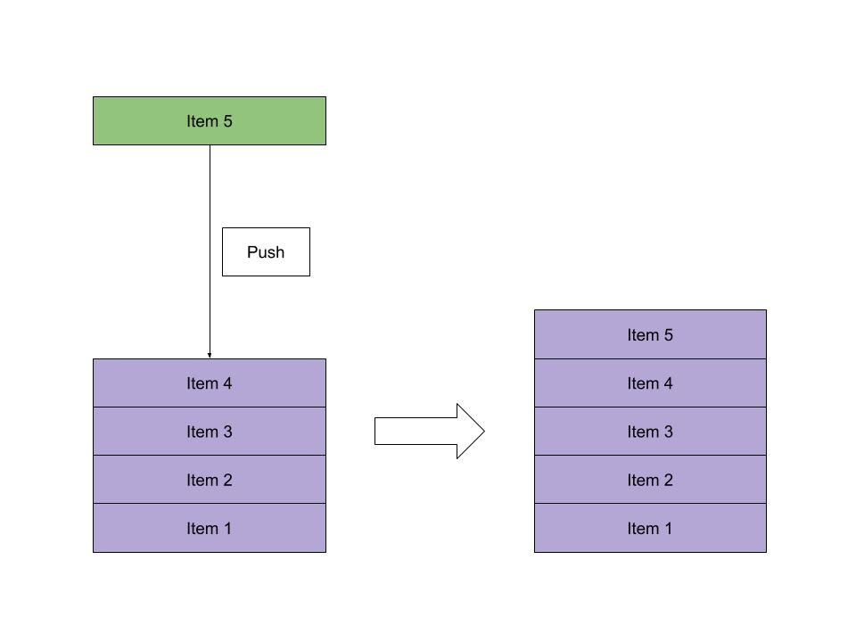
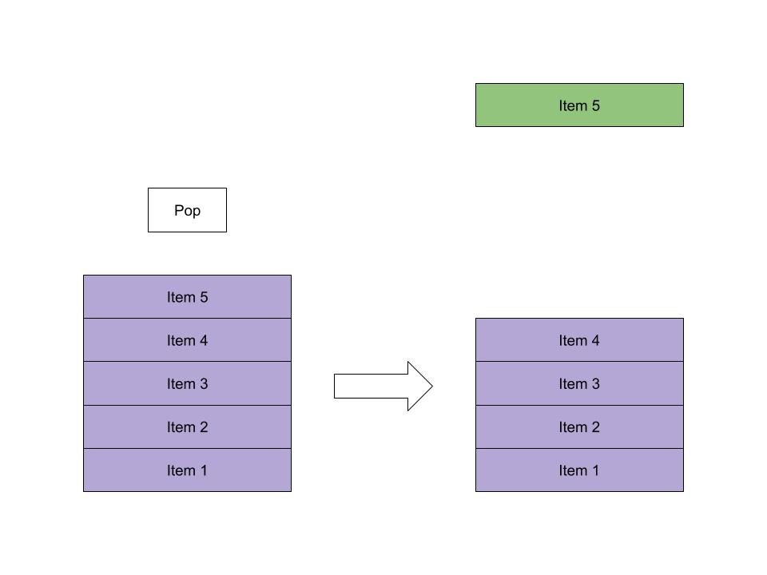
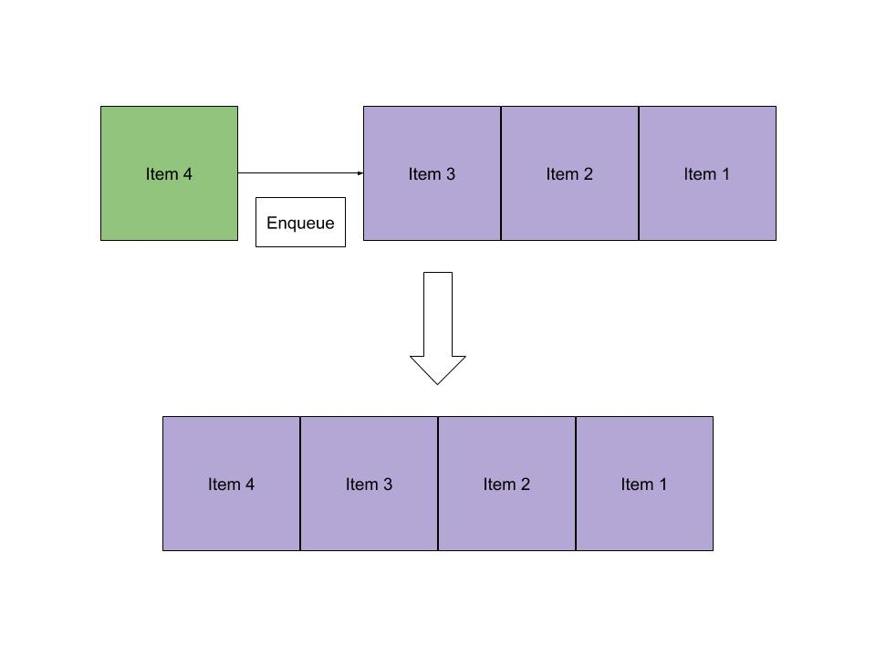
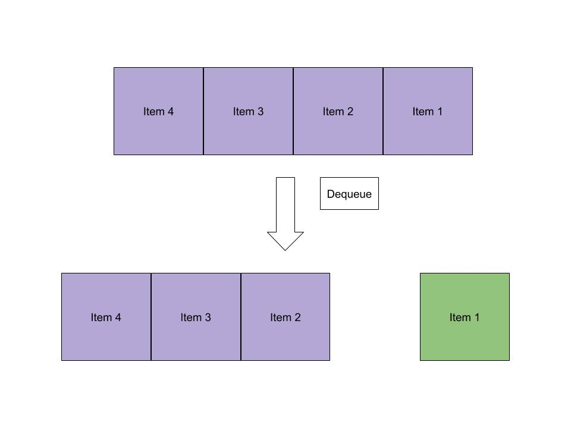

# Stacks and Queues
 
Stacks and queues are simple data structures that allow us to store and retrieve data sequentially. In a stack, the last item we enter is the first to come out. In a queue, the first item we enter is the first come out.

We can add items to a stack using the push operation and retrieve items using the pop operation. With queues, we add items using the enqueue operation and retrieve items using the dequeue operation.

In Python, we can implement stacks and queues just by using the built-in List data structure. Python also has the deque library which can efficiently provide stack and queue operations in one object. Finally, we've made our stack and queue classes for tighter control of our data.

There are many real-world use cases for stacks and queues, understanding them allows us to solve many data storage problems in an easy and effective manner. 

Big(O) for Stack and Queue
| Big(O)  | Access  | Search | Insertion  | Deletion   | space |
| ------------- |-----------------| ------| ------------- |-----------------| ------|
| Stack         | O(n)            | 	O(n) | O(1)          |  O(1)           |   O(n)|
| Queue         | O(n)            | 	O(n) | O(1)          |  O(1)           |   O(n)|

## Stack
Stacks, like the name suggests, follow the Last-in-First-Out (LIFO) principle.
As if stacking coins one on top of the other, the last coin we put on the top is the one that is the first to be removed from the stack later.

### push - adds an element to the top of the stack:

### pop - removes the element at the top of the stack:

## Queue
Queues, like the name suggests, follow the First-in-First-Out (FIFO) principle. As if waiting in a queue for the movie tickets,
the first one to stand in line is the first one to buy a ticket and enjoy the movie.

### enqueue - adds an element to the end of the queue:

### dequeue - removes the element at the beginning of the queue:

